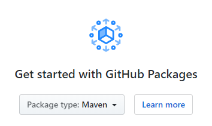
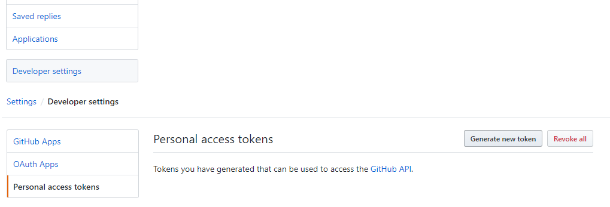

# Using the GitHub packages Maven repository

<small>2020 January 11</small>

You may've heard about [GitHub Packages](https://github.com/features/packages) which allows you to publish and consume packages with various repositories. One in particular is Maven repositories, which we'll explore in detail in this post.

You'll be needing the following:

* A GitHub account
* A [saker.build system release](root:/saker.build/doc/installation.html). (Included in the example project.)

#### Create a git repository

First we [create a simple git repository on GitHub](https://github.com/new "Create a New Repository"). It can be private, you'll still be able to use the Maven repository features.

We recommend that you initialize it with a README, so cloning it might be easier.

After you've created it, you'll notice the **0 packages** link in the repository header. After clicking it, you'll be redirected to the site where the published artifacts will be visible.



#### Creating your app

You probably have something in mind that you want to publish to GitHub packages. For this example, we're going to have a simple utility class with a dependency on [Apache Commons Lang](https://github.com/apache/commons-lang).

You can set up your project in any way you like, or just clone the [example repository](https://github.com/Sipkab/example-gh-maven) that we use for this post. It simply resolves the Maven dependencies, compiles the app into a JAR, and deploys it to GitHub Packages.

```shell
git clone https://github.com/Sipkab/example-gh-maven.git
```

#### Creating a personal access token

In order to be able to publish to the Maven repository, you'll need to authenticate yourself with GitHub. In order to do that, you need a personal access token that you can use to log in when deploying the artifacts.

You can create these access tokens by going to your account settings, navigate to *Developer settings* and select *Personal access tokens*.



Once you're here, select *Generate new token*. The generated token will be used to access the repository you're deploying for. Select the *write:packages*, and *read:packages* scopes for your token. The *repo* scope will also be selected automatically for you.


You can name your token any way that you'd like, its just for informational purposes.

#### Back to the project

If you've checked out the example repository, you can build your project by running the following command:

```plaintext
java -jar saker.build.jar -bd build export
```

This will result in the creation of a JAR file at the `build/saker.jar.create/output.jar` path. It will contain the compiled classes from the `src/main/java` directory.

<small>Tip: you don't have to deal with command line when using the [Eclipse plugin](root:/saker.build/doc/eclipseplugin.html).</small>

### Deploying to GitHub

For deployment, we use the [`saker.maven.deploy()`](root:/saker.maven.support/taskdoc/saker.maven.deploy.html) build task. It will take the specified artifacts, and upload them to GitHub. Let's see it in more detail:

```sakerscript
deploy() {
	# Replace USERNAME, REPOSITORY_NAME, and PERSONAL_ACCESS_TOKEN literals with your own
	$jar = include(export)[jar]
	saker.maven.deploy(
		Artifacts: {
			"pom": pom.xml,
			"jar": $jar[Path],
		},
		Coordinates: "example.saker.build:maven-gh-packages:0.1.0",
		RemoteRepository: {
			Id: github,
			Url: "https://maven.pkg.github.com/USERNAME/REPOSITORY_NAME",
			Authentication: saker.maven.auth.account(
				Username: USERNAME,
				Password: PERSONAL_ACCESS_TOKEN,
			)
		}
	)
}

```

<small>Tip: you can click on task names to view their documentation.</small>

You can run the above with the following command:

```plaintext
java -jar saker.build.jar -bd build deploy
```

We specify the artifacts using the `Artifacts` parameter. We deploy the `pom.xml` alongside our Java archive to GitHub. The `Coordinates` of the deployed artifacts need to be specified, so the [`saker.maven.deploy()`](root:/saker.maven.support/taskdoc/saker.maven.deploy.html) task knows what it is publishing.

The `RemoteRepository` parameter specifies the repository where we're publishing. The `Url` should be based on the above, but with the `USERNAME` and `REPOSITORY_NAME` replaced with your values.

Remember the previously generated personal access token? We use it here by providing an account based authentication mechanism for the deployment. It needs to be set to the `Authentication` field of the `RemoteRepository`, and the credentials need to be given to the [`saker.maven.auth.account()`](root:/saker.maven.support/taskdoc/saker.maven.auth.account.html) build task. Be sure to replace the `PERSONAL_ACCESS_TOKEN` literal with your own access token.

**Important!** After deploying artifacts to GitHub Packages, you won't be able to overwrite them! Not even `SNAPSHOT` artifacts. You can [delete](https://help.github.com/en/github/managing-packages-with-github-packages/deleting-a-package) them, but it should be only used as a last resort.

### Using the repository

After deploying, you probably want to use your artifacts. You can authenticate yourself for other Maven build tasks the same way you did for deployment:

```sakerscript
saker.maven.resolve(
	Artifacts: "example.saker.build:maven-gh-packages:0.1.0",
	Configuration: {
		Repositories: [
			{
				Id: central,
				Url: "https://repo.maven.apache.org/maven2/",
			},
			{
				Id: github,
				Url: "https://maven.pkg.github.com/USERNAME/REPOSITORY_NAME",
				Authentication: saker.maven.auth.account(
					Username: USERNAME,
					Password: PERSONAL_ACCESS_TOKEN,
				),
			}
		]
	}
)
```

The above will use the `central` repository as well as the one we deployed our artifact to. The dependencies of our artifact will be resolved, resulting in the following:

```plaintext
org.apache.commons:commons-lang3:jar:3.9
example.saker.build:maven-gh-packages:jar:0.1.0
```

If your git repository is public, you can omit the `Authentication` when retrieving from the repository.

### Further improvements

You may've noticed that we specified the full configuration and credentials for accessing GitHub Packages in both of the examples. This would be very verbose and make the build scripts hard to follow. You can easily export this configuration to a `static` or `global` variable for the build, letting you define the congfiguration in a single place:


```sakerscript
static(GITHUB_CONF) = {
	Id: github,
	Url: "https://maven.pkg.github.com/USERNAME/REPOSITORY_NAME",
	Authentication: saker.maven.auth.account(
		Username: USERNAME,
		Password: PERSONAL_ACCESS_TOKEN,
	)
}
saker.maven.deploy(
	Artifacts: {
		"pom": pom.xml,
		"jar": $jar[Path],
	},
	Coordinates: "example.saker.build:maven-gh-packages:0.1.0",
	RemoteRepository: static(GITHUB_CONF)
)
saker.maven.resolve(
	Artifacts: "example.saker.build:maven-gh-packages:0.1.0",
	Configuration: {
		Repositories: [
			{
				Id: central,
				Url: "https://repo.maven.apache.org/maven2/",
			},
			static(GITHUB_CONF)
		]
	}
)
```

We also recommend exporting the whole `Configuration` parameter value of Maven operations.

You should also make effors to not upload your personal access tokens to GitHub. You should store them in a build script file that is not uploaded to version control, and set the `.gitignore` to exclude it. You can the `include()` that build script from the known location and use the token from there. We employ this behaviour in the [saker.build repositories](https://github.com/sakerbuild/saker.build/tree/ec4b88671fd77d8c9f61faf4c7fc8973f80b08a0/secret).

## Conclusion

GitHub packages can be a nice place to distribute your Maven artifacts. Be it private or public use, having a free option (or paid for larget scale) to host some content allows you to experiment with your software and may require less hassle to maintain. It is also alongside your repository, making discoverability easier.

However, others who consume the artifacts that you publish to GitHub Packages will need to add it to their Maven repositories. If a lot of people publishes to GitHub Packages, this list of repository configuration can grow significantly, making it hard to maintain. We recommend you publish to already established repositories to allow easier access to your artifacts.

<small>This post was made because the [saker.maven.support](https://nest.saker.build/package/saker.maven.support?version=v0.8.2) package was just updated to support authentication, installation, and deployment. We wanted to showcase this through the publishing workflow to GitHub Packages that you can try right out.</small>
