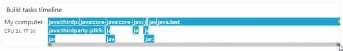
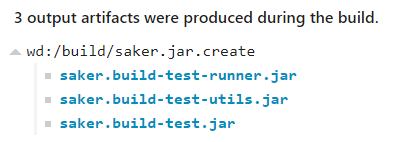

# Introducing the build trace for saker.build

<small>2020 February 20</small>

Build failures and performance bottlenecks can be hard to debug. You most likely don't want to spend your work time deciphering build logs or error stacktraces to overcome these issues. This is where the new build trace feature for saker.build comes in.

A build trace is a recording of your build execution with the most relevant information collected in it. It records the build configuration, task executions, exceptions, build output, script contents, output artifacts and other information and can be displayed for you to examine possible issues.

Let's see how it works.

#### Create and view a build trace

<small>If you're not already using saker.build see the [](root:/saker.build/doc/installation.html) guide.</small>

Generating a build trace is as easy as adding a command line argument to your build:

```plaintext code-wrap
java -jar saker.build.jar -trace pwd://build/build.trace [...]
```

The [`-trace`](root:/saker.build/doc/guide/cmdlineref/build.html#-trace) option specifies that a build trace should be generated at the specified path.

<small>In the above example we generate it in the `[working-directory]/build/build.trace` file. You can also create a build trace by changing your IDE project configuration.</small>

After your build has run, you can view it by opening it on the [saker.build/buildtrace](raw://buildtrace.html "Build trace | saker.build") page. **Your build trace file is not uploaded, and purely opened in your browser only.**

You can view [this example build trace](raw://buildtrace.html?url=%2Fres%2Ftrace_example_saker.build.trace) if you'd like to follow along.

### Build summary

The first page that greets you when opening a build trace is the summary of the result and build configuration.

[](trace_summary.png)

<small style="text-align: center;">

Build result and execution time summary

</small>

The most crucial information of your build is its result and performance right at the start. If you look further, you can view the actual build configuration that was used. (Open [the example build trace](raw://buildtrace.html?url=%2Fres%2Ftrace_example_saker.build.trace) to view for yourself.)

Let's move on to my favorite page, the timeline.

### Timeline

The timeline page is where you can see the task executions on an interactive chart. You can easily determine which tasks took how much time during build execution and also view their individual configurations.

[](trace_timeline_build.gif)

<small style="text-align: center;">

Build timeline

</small>

We can immediately see that the *java.test* task took the most time during the build, which is not surprising as testing often takes longer than compilation. Rest of the build consisted of Java compilations. It is also apparent that the build automatically parallelized itself to 3 concurrent tasks as the same time.

You can view the details of each task by clicking on a task in the timeline, or finding them in the below table by yourself:

[](trace_task_details.png)

<small style="text-align: center;">

Task details

</small>

##### Build clusters

You may've noticed the *My computer* section on the above timeline. It signals that a given task was executed on that build machine. It becomes of significance when you use build clusters for your build.

[](trace_timeline_inner_tasks_cluster.png)

<small style="text-align: center;">

Build cluster timeline

</small>

The above timeline was taken from [the C++ example build trace](raw://buildtrace.html?url=%2Fres%2Ftrace_example_msvc_clusters.trace). You can see that while most of the compilations were done on *My computer* which is the main PC we perform our build on, some of the compilations were delegated to the *laptop* build cluster.

You can easily identify how much performance improvement can the addition of a build cluster give, and how much it was utilized during the build.

<small>You can view this timeline by opening the *Inner tasks* option of the *saker.msvc.ccompile:default/x64* task in the mentioned build trace.</small>

### Additional information

The *Console output* page contains the complete output log of the build. It may be slightly different than the one you see in the build console during execution, as the individual output lines are deinterlaced so you can view the output of each task without interfering with others.

The *Artifacts* page allows you to browse the notable build output artifacts that were produced during the execution. You can also retrieve these files from the build trace if you configured the build accordingly. (See [`-trace-artifacts-embed`](root:/saker.build/doc/guide/cmdlineref/build.html#-trace-artifacts-embed) command line option.)

[](trace_artifacts.png)

<small style="text-align: center;">

Output artifacts

</small>

## Advantages

If you're reached this point of the article and somewhat familiar with Java build systems, you may notice that the build trace feature of saker.build has similar features to the [Gradle Build Scan](https://gradle.com/build-scans/).

The major advantage of build trace for saker.build is that it is offline. You don't need internet connection to create a build trace, and don't need to upload it to a server to be able to view it. You don't need an enterprise subscription neither need to accept any terms and conditions. You can simply share the build trace file with others to collaborate or publish it to some public or private site as the build trace viewer can also open URLs.

## Bonus Azure Pipelines support

For building saker.build and related projects, we use Azure Pipelines as the CI server. In case of build failures, we want to examine the causes of it, and the build trace is one of the best practices for this rather than dealing with the logs directly on the Azure Pipelines website.

So in order to do this, we need to configure the CI builds as follows:

1. Create a build trace during builds.
	* Quite simple by using the [`-trace`](root:/saker.build/doc/guide/cmdlineref/build.html#-trace) command line option.
2. Retrieve the build trace artifacts and open them in the build trace viewer.
	* This is a bit trickier.

First, we need to configure the CI builds to publish the build trace artifacts. We can do that by using the [`PublishBuildArtifacts@1`](https://docs.microsoft.com/en-us/azure/devops/pipelines/tasks/utility/publish-build-artifacts?view=azure-devops) Azure Pipelines task.

The setup in YAML:

```plaintext
- script: java -jar saker.build.jar -bd build -trace pwd://build/build.trace -trace-artifacts-embed export
  displayName: 'Export'
- task: PublishBuildArtifacts@1
  condition: always()
  displayName: 'Publish build trace'
  inputs:
    pathtoPublish: build/build.trace
    artifactName: trace
```

The above specifies two tasks. The first one builds our project, and creates the build trace as the `build/build.trace` file. The second task publishes the created build trace as a build artifact, and you will be able to manually download it.

[](azure_dashboard.png)

<small style="text-align: center;">

Azure Pipelines dashboard (See bottom right corner)

</small>

If you click on the *1 published* link, you can download the published artifacts for the build, which includes the created build trace. You can then unzip and open the downloaded file in the build trace viewer.

<small>Note: Don't forget to add the `condition: always()` line to the publishing task so your build trace is published even if the build fails!</small>

### One more thing...

Downloading and opening the build trace file feels like too much hassle. And it is. That's why we implemented support for automatically querying and opening the build artifacts as build trace files.

Simply drag the *1 published* link from the Azure dashboard to the build trace viewer. If you have published multiple build traces for the build, don't worry, the viewer will ask you which one to open.

[](azure_open_artifact.gif)

<small style="text-align: center;">

Open CI artifact as build trace by dragging and dropping

</small>

You can also drag & drop other Azure build links which contain the organization, project name, and the `buildId` parameter.

## Further improvements

There are still a few things that we wish for the build trace to contain. Various dependency information, additional information about the tasks, the task dependencies and their relations, more information about remote execution, and others. We consider the current implementation as a *good start* for implementing great build trace support for the saker.build system.

We'll be continuously improving the build trace UI and recording as time goes on, however, you can still try it out as it was released in the 0.8.6 version of the saker.build system just a week ago.

If you want to report an issue, or just want to find us on GitHub, see more at [sakerbuild/saker.build](https://github.com/sakerbuild/saker.build). 
