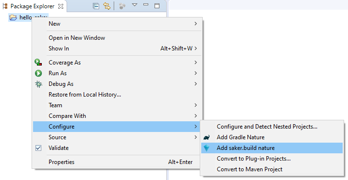
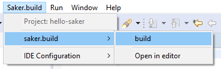
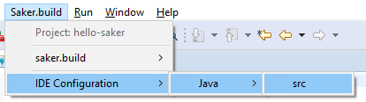

# Eclipse plugin

The following contains installation, introduction, and other information about the Eclipse plugin for saker.build.

The source code for the plugin is available on GitHub: [sakerbuild/saker.build.ide.eclipse](https://github.com/sakerbuild/saker.build.ide.eclipse).

## Installation

Open Eclipse, and choose the Help > Install New Software... option in the menu.

Enter the `https://saker.build/saker.build.ide.eclipse/update-site/v#MACRO_VERSION_ECLIPSE_PLUGINS` update site into the *Work with:* text field, and press Enter. Eclipse should load the following plug-ins from the site:


You may need to uncheck *Group items by category* to see the plug-ins. Select *Saker.build system plugin* to add the saker.build system support to Eclipse. If you plan on using Java, we recommend installing *Java IDE support for Saker.build* as well.

Wait for the installation to complete, and restart Eclipse.

(If you're prompted with a warning that you're installing unsigned content, click on *Install anyway*.)

## Configuring a project

You can add saker.build to new, or existing project as well. To get started, create a new general project using the File > New > Project... menu and the General > Project option:


No other configuration is required for it, simply enter the Project name and Finish:


A new empty project will be created. You can add the saker.build system for it by right-clicking on it and choosing Configure > Add saker.build nature:



This will cause the saker.build system to be used by your project. 

If you don't already have a build file in your project tree, you can add a new one by right clicking the project and using the Saker.build > Add new build file option:


This will cause an empty `saker.build` file to be created in your project root. You can also add new build files by using the New > File option.

## Running a build

Let's continue our example from above. We're going to compile some Java sources. Create a new directory for your project called `src` using the New > Folder option.

Open the `saker.build` build file, and add the following to it:

```sakerscript
saker.java.compile(src)
```

You can build the project using the following ways:

**1. Saker.build > [build_script.build] > [build-target]**

You can manually select the build target to be run from the saker.build menu:



It will cause the selected build target to be run for your project.

**2. Use the Run saker.build command (hotkey)**

The saker.build Eclipse plugin provides a command that can be invoked to run the build for the active project. It is bound to the key F9 by default. You can simply press F9 to run saker.build for your project.

It will run the last build target that was executed for the project. If there's none, it will ask you to choose one:


You can modify the associated hotkey in the Window > Preferences > General > Keys > Run saker.build option:


(Dialog cropped and modified for size.) 

## Applying project configuration

After you've run the build in the previous example, you may want to configure your project to have Java development support enabled for it. During the build, the build tasks will generate meta-information about the executed operations. These are called IDE configurations, and you can apply them to your project by choosing the Saker.build > [language] > [configuration-ID] option:

(Note that the following assumes you've selected *Java IDE support for Saker.build* in [](#installation) as well.)



Selecting it will open the configuration dialog where you can choose which aspects of the generated IDE configuration to apply to your project:


Based on the previous builds, applying the above will cause your project to have Java support, and will set the `src` directory as a source directory. The configuration also applies the specified JRE to your project. Clicking OK will configure your project as follows:


The project configuration supports more complex examples as well, including classpath, modulepath, multiple source directories, and others.
