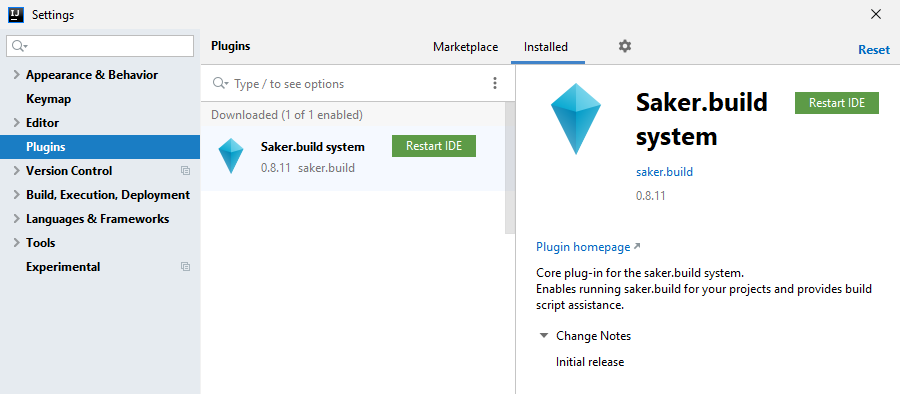
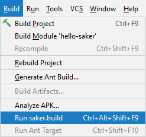
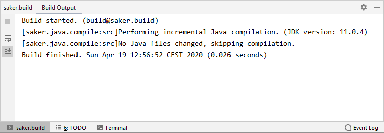

# IntelliJ plugin

The following contains installation, introduction, and other information about the IntelliJ plugin for saker.build.

The source code for the plugin is available on GitHub: [sakerbuild/saker.build.ide.intellij](https://github.com/sakerbuild/saker.build.ide.intellij).

## Install via marketplace

You can install the saker.build plugin through the [JetBrains plugin marketplace](https://plugins.jetbrains.com/plugin/14152-saker-build-system).

0. Open the IDE.
1. Open the *File* > *Settings* dialog.
2. Select the **Plugins** page.
3. On the *Marketplace* tab, search for *saker.build*, or simply *saker*.
4. Select and install the *Saker.build system* plugin.
5. Restart the IDE. 


## Download manually

You can download and install the plugin manually. Each version is available as a GitHub release [on the releases page](https://github.com/sakerbuild/saker.build.ide.intellij/releases).

0. Download a release that you want to install.
	* Look for the file with the `saker.build.ide.intellij-v<version>.jar` name.
1. Open the IDE.
2. Open the *File* > *Settings* dialog.
3. Select the **Plugins** page.
4. Click the gear icon and select *Install Plugin from Disk...*


5. Select the downloaded JAR file.
6. Restart the IDE.



## Creating a project

Select the File > New > Project... option, and choose the *Empty Project* type.


Next, select the File > Add saker.build support menu. This adds support for running saker.build part of your project.


Now you have an empty project, but no build files. You can add one through the *Saker.build* menu, by choosing *Add new build file*.


A new file with the name *saker.build* will be added to the root of your project.

## Running a build

Continuing our example from above, let's compile some Java code.

First, create a new directory called *src*. Then, open the `saker.build` build file, and add the following to it:

```sakerscript
saker.java.compile(src)
```

This will simply compile all `.java` source files in our `src` directory. (Currently it won't compile anything, as we haven't added sources yet, but running a build will succeed nonetheless.)

Let's build! We can do that in the following ways:

**1. Selecting the build target to run**

You can select a specific build target in the `Saker.build` menu:


**2. Selecting the Build > Run saker.build action**

The *Run saker.build* action will run the last build target that you've choosen for the project. You can also use the associated hotkey to run the build quickly.



If it can't determine the last build target, it will ask you which one to run.


**Build console**

The output of the build execution is available in the *saker.build* tool window. It will automatically pop up as you start a new build:

 

## Applying project configuration

<div class="doc-wip">

The project configuration support is still work in progress for the IntelliJ plugin. It will allow you to automatically configure the IDE project based on a build execution. E.g. properly set classpath and source directories.

As we're still working on this, we recommend you manually do these steps in the *Module Settings* dialog of IntelliJ.

</div>

