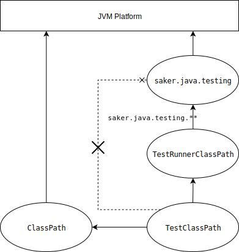

# Test classpath

During the testing, multiple classpaths are loaded in order to properly set up the testing environment. The task needs to load the test runner, the classes that are being tested, and the test cases. All of them are part of different [`ClassLoaders`](https://docs.oracle.com/javase/8/docs/api/java/lang/ClassLoader.html), and they have different visibilities in order to properly ensure runtime class loading.

We define the following class loaders:

* [`ClassPath`](/taskdoc/saker.java.test.html#ClassPath) (also known as user classpath).
	* Contains the classes that are the subject of the testing.
* [`TestRunnerClassPath`](/taskdoc/saker.java.test.html#TestRunnerClassPath).
	* Contains the classes for the test runner. The test runner is used to invoke the test cases. (E.g. jUnit, or other testing frameworks)
* [`TestClassPath`](/taskdoc/saker.java.test.html#TestClassPath).
	* Contains the classes of the test cases that are being executed.

The above class loaders are in a relation as the following diagram illustrates:

Based on the above, we can see the setup of the class loaders during testing. The `ClassPath` classloader have access *only* to the standard JVM classes. It cannot access classes defined in the `Test(Runner)ClassPath` class loaders.

The `TestRunnerClassPath` is the one that contains the testing framework. It is responsible for invoking the tests defined in `TestClassPath`. It can access the classes defined in the saker.java.testing package (the saker.nest package), and only the classes with the package prefix of `saker.java.testing`. This is order for the test runner to be able to integrate with the saker.java.testing API.

The test runner classpath won't be able to access other classes from the saker.nest or saker.build runtime.

The `TestClassPath` can access the classes from `ClassPath` in order to test them. It can also access the `TestRunnerClassPath` in order to integrate with the test runner framework. However, it **cannot** access the classes from the `saker.java.testing` package, or any other transitive parent class loaders.

**But how does the `TestRunnerClassPath` know about the test cases defined in `TestClassPath`?**

You might ask. The test runner is initialized with the reference to the `TestClassPath` (this is not displayed in the above diagram). For each test case that is being invoked, the test runner will be passed the name of the test case class. It will then use the [`ClassLoader`](https://docs.oracle.com/javase/8/docs/api/java/lang/ClassLoader.html) for the test class path, and load the test case class for the given name.
